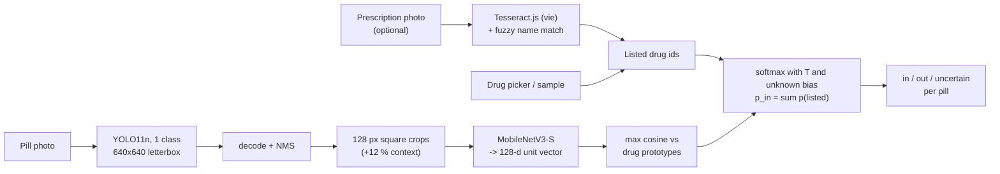

# PillGuard — Project Specification

> Status: implementation complete, training run pending · Updated: 2026-09-18 · Version 0.2 (English rewrite)

PillGuard takes a prescription (a list of drugs) and a photo of the pills in a person's hand,
then flags every pill that is **not on that prescription**, or answers **"uncertain"** and asks
for a better photo or a pharmacist. Detection, recognition and the decision all run in the
browser with ONNX Runtime Web; no image ever leaves the device. The core is a six-week build;
an optional DDPM module adds two more.

> **This is a research demo, not a medical device.** It gives no dosage advice, and it only
> knows the drugs of one public dataset. Anything outside that set is reported as "not on the
> prescription".

---

## 1. Purpose and scope

### 1.1 Problem framing

Published pill-recognition work reports mAP over the full drug catalogue and assumes a server.
Two gaps are left open: models are confidently wrong on look-alike pills, and they are hard to
run on the device where the photo is taken.

PillGuard narrows the problem instead of chasing the leaderboard. **The prescription is known**,
so every pill only has to be sorted into one of three buckets:

| verdict | meaning | what the user sees |
|---|---|---|
| `in` | the pill matches one of the drugs on the prescription | the matched drug name |
| `out` | the pill matches none of them | a warning |
| `uncertain` | the evidence is too weak to decide either way | retake the photo / ask a pharmacist |

That is a far smaller problem than telling 107 drugs apart, and it is the problem a patient
actually has. The cost of the two error types is asymmetric: missing a wrong pill is worse than
a false alarm, and both are worse than an honest "uncertain".

### 1.2 Goals

* **G1 — Catch pills that are not on the prescription.** The primary metric is out-of-prescription
  recall at a bounded false-alarm rate.
* **G2 — Abstain instead of guessing.** Every verdict comes from a calibrated probability, and
  an explicit reject band produces "uncertain" with actionable advice.
* **G3 — Run entirely in the browser.** Static hosting on GitHub Pages, no server, no upload,
  ≤ 30 MB of models, ≤ 1 s per photo on a laptop.
* **G4 (optional) — A hand-written DDPM** that generates crops for the rarest drugs, evaluated
  as an ablation rather than shipped.

### 1.3 Non-goals

* Not a medical device; no dosage, interaction or substitution advice.
* Not an attempt to beat the state of the art on mAP.
* No support for drugs outside the dataset's 107 classes — they are reported as `out`, not named.
* No OCR of handwritten prescriptions; only printed Vietnamese prescription scans, and only as
  an experimental input path (§5.6).
* No user accounts, no telemetry, no server-side storage of any kind.

### 1.4 Glossary

| term | meaning |
|---|---|
| **pill photo** | one dataset photo showing 1–11 loose pills, with one box per pill |
| **prescription** | a scanned printed prescription; the annotation maps OCR lines to drug class ids |
| **listed drug** | a drug id handed to the matcher for a given photo (the prescription contents) |
| **seen / unseen drug** | seen = used to train the embedding network and build prototypes; unseen = deliberately held out (§3.4) |
| **foreign pill** | a pill VAIPE labels `107`, i.e. a pill that belongs to another prescription |
| **scenario** | one photo paired with one (possibly modified) drug list, plus per-pill ground truth (§3.5) |
| **prototype** | a unit vector representing a drug in embedding space (§5.3) |
| **parity** | agreement between the Python pipeline and the browser pipeline on identical pixels (§7.5) |

---

## 2. Requirements

### 2.1 Functional

| id | requirement |
|---|---|
| F1 | Accept a drug list by (C) picking from a searchable list, (B) loading a sample prescription, or (A) scanning a prescription photo with in-browser OCR. |
| F2 | Accept a pill photo from a file picker or the device camera. |
| F3 | Detect every pill in the photo as a class-agnostic box. |
| F4 | Produce one verdict per detected pill — `in` / `out` / `uncertain` — with the matched or closest drug name and the calibrated probability behind it. |
| F5 | Summarise the photo: "all N pills match", "warning: k of N not on the prescription", "k uncertain". |
| F6 | Run the full pipeline offline after first load; never transmit the image. |
| F7 | Expose the same pipeline from Python (`pillguard.pipeline.PillGuardPipeline`) for evaluation and parity testing. |
| F8 | Reproduce every published number from a fixed split file and versioned commands. |

### 2.2 Non-functional

| id | requirement | target |
|---|---|---|
| N1 | Total model download | ≤ 30 MB (INT8 ONNX, both models) |
| N2 | End-to-end latency, one photo, single-threaded WASM | ≤ 1 s on a laptop; measured and reported on a phone |
| N3 | Single model file size | < 50 MB (GitHub warning threshold, enforced in CI) |
| N4 | Python ↔ browser verdict agreement | 100 % of parity cases |
| N5 | Hosting | static files only; no build step for the page |
| N6 | Training hardware | one RTX 3060 12 GB; full pipeline ≤ 2 h after ingest |
| N7 | Privacy | no upload, no cookies, no analytics |
| N8 | Licence hygiene | AGPL-3.0 code (Ultralytics); no redistribution of dataset images |

---

## 3. Data

### 3.1 Source and provenance

The dataset is **VAIPE** (VinUni–Illinois Smart Health Center): Vietnamese phone photos of loose
pills, paired with scans of the prescriptions they came from.

The copy used here is the public Hugging Face mirror **`Elfsong/VAIPE_PILL`**, which is the
AI4VN-2022 challenge release. It is *not* the split used by the PGPNet paper; see §10.1 for the
evidence and the consequences.

| | this project (HF mirror) | PGPNet paper |
|---|---|---|
| labelled photos | 9,502 (`public_train`) | 7,514 train + 1,912 test = 9,426 |
| unlabelled photos | 1,500 (`public_test`: no boxes, no labels) | – |
| drug classes | 107 (ids 0–106) plus label `107` = "not on this prescription" | 96 |
| prescriptions | 1,173 with OCR lines mapped to drug ids | 1,527 |
| pill boxes | 32,828, of which 8,398 carry label 107 | – |

### 3.2 Ingestion

`pillguard ingest` streams the mirror's parquet shards and writes a compact local layout. It is
resumable (`ingest_state.json` records finished shards) and takes about 25 minutes at 18 MB/s.

```
data/vaipe/
  images/pill/<file>.jpg               long side ≤ 1280 px
  images/prescription/<file>.jpg       long side ≤ 1600 px (kept larger for OCR)
  annotations/pill_train.jsonl         {file, width, height, boxes[[x1,y1,x2,y2]], labels[], src_split}
  annotations/prescription_train.jsonl {file, texts[], ann_labels[], mappings[]}
  pill_pres_map_train.json             {prescription_file: [pill_file, ...]}
  classes.json                         id -> name, aliases, box and photo counts
  ingest_state.json
```

Three decisions matter downstream:

1. **EXIF orientation is applied before anything else.** VAIPE boxes were annotated on the
   *rotated* image; ignoring the orientation tag silently transposes every box on a large part of
   the dataset.
2. **Photos are downscaled during ingest**, not at training time: the 4032×3024 originals are ~27 GB,
   and at 1280 px a pill is still 80–120 px wide against a 128 px crop. Boxes are rescaled with the
   image. The ingested copy is ~1.6 GB.
3. **Boxes are converted from `[x, y, w, h]` to `[x1, y1, x2, y2]`** in saved-image pixels, which is
   the convention everywhere else in the codebase.

The mirror's `public_test` split has neither boxes nor labels, so it is skipped by default and plays
no part in any reported number.

### 3.3 Dataset statistics

Computed by `pillguard eda` on the ingested copy (full output in [docs/eda.md](docs/eda.md) and
`docs/eda_stats.json`):

| quantity | value |
|---|---|
| photos / pills / classes / prescriptions | 9,502 / 32,828 / 107 / 1,173 |
| pills labelled 107 (foreign) | 8,398 in 1,884 photos |
| pills per photo | mean 3.45, median 3, max 11 |
| pills per class | min 1, p25 51, median 102, max 2,599 |
| classes with < 20 pills | 10 (ids 13, 21, 25, 32, 49, 66, 77, 86, 88, 102) |
| pill width ÷ photo width | p5 0.082, median 0.152, p95 0.289 |
| drugs per prescription | mean 2.42, max 5 |
| photos per prescription | mean 8.1, max 132 |
| saved photo sizes | 960×1280 (6,917), 1280×960 (2,039), 720×960 (270) |

Two facts drive design decisions: the class distribution is heavily long-tailed (a 2,599 : 1 ratio,
which is why training uses a balanced sampler and why the DDPM module is interesting at all), and one
prescription can own up to 132 near-duplicate photos (which is why the split is grouped).

### 3.4 Fixed split

`pillguard split` writes `splits/vaipe_v1.json` — file names only, small enough to commit, and the
single source of truth for every reported number.

* **Grouped by prescription.** All photos of one prescription land in the same subset. A random
  per-photo split would leak near-identical shots (taken seconds apart, of the same pills) across the
  train/test boundary.
* **Deterministic.** Group order comes from `sha1(seed:group)`, so the split does not depend on
  directory listing order. `SEED = 20260918`.
* **Target fractions:** 15 % test, 15 % validation, the rest train, measured in photos.
* **Unseen drugs.** `N_UNSEEN_CLASSES = 12` drugs are held out of embedding training and of the
  prototype bank. They are drawn from the 25th–75th percentile of per-class photo frequency, so the
  novelty test is neither trivially rare nor dominant. Their pills still appear in val/test photos,
  where they must be flagged `out`. **The detector is class-agnostic and still trains on their
  boxes** — novelty is a recognition problem, not a detection one.

| subset | photos | pills | prescriptions |
|---|---|---|---|
| train | 6,622 | 22,823 | 777 |
| val | 1,430 | 4,970 | 196 |
| test | 1,449 | 5,034 | 200 |

Held-out drugs: ids 4, 6, 50, 63, 71, 74, 80, 81, 85, 95, 105, 106 — BECOSEMID 40mg,
SADAPRON 300 300mg, FAMOGAST 40mg, BROMHEXIN ACTAVIS 8mg, VACO LORATADINE 10mg, MENISON 4MG 4mg,
MILURIT 300mg, MELOXICAM 7,5mg, NORMAGUT 250mg, VENRUTINE 100mg +500mg, VITAMIN C STADA 1G 1g,
C1000 FLOODE 1g.

### 3.5 Out-of-prescription scenarios

There is no dataset of "wrong pill" photos, so one is constructed from the labels. A **scenario**
pairs one photo with a modified copy of its prescription; the ground truth per pill follows from the
modification, which means no extra annotation and no human in the loop.

| scenario kind | construction | purpose |
|---|---|---|
| `clean` | the prescription as written, minus any unseen drugs (which are never listed) | measures false alarms on a correct pill set |
| `remove-1` | delete 1 drug that is both on the prescription and visible in the photo | every pill of that drug must be flagged `out` |
| `remove-2` | delete 2 such drugs | harder version of the same test |

Per-pill ground truth carries a `reason`, which is what the evaluation slices on:

| reason | ground truth | source |
|---|---|---|
| `listed` | `in` | the pill's drug is on the modified list |
| `removed` | `out` | the scenario deleted that drug from the list |
| `foreign` | `out` | VAIPE label 107: a pill from another prescription |
| `unseen` | `out` | a held-out drug the model was never trained on |
| `unlisted` | `out` | the annotation says a seen drug the prescription never mentions — rare label noise, reported separately and **excluded from headline numbers** |

Generation is deterministic per `(seed, photo)` via `sha1`, so scenarios are stable regardless of
iteration order, and a photo without a prescription annotation falls back to using its own seen
labels as the list. Output: `data/vaipe/scenarios_val.jsonl` and `data/vaipe/scenarios_test.jsonl`.

### 3.6 Synthetic data (tests)

`pillguard.data.synthetic` writes the *same* on-disk layout with generated shapes, so the whole
pipeline — split, scenarios, crops, matcher, ONNX export, browser parity — is exercised by `pytest`
on a machine that has never downloaded VAIPE. CI relies on this.

### 3.7 Fallback plan

If the mirror disappears, the fallback is an international pill dataset (NLM Pill Image Recognition
Challenge, ePillID or CURE). The prescription half is then simulated from drug-name lists, options
(B) and (C) of §5.6 still work, and only the OCR path (A) is lost.

---

## 4. Architecture

### 4.1 Data flow



Recognition is deliberately split from detection: the detector never learns drug identity, so adding
a drug means adding prototype vectors, not retraining anything.

### 4.2 Components

| component | choice | rationale |
|---|---|---|
| Detector | Ultralytics YOLO11n, single class `pill` | 2.6 M parameters; the task (one class, large objects) is easy, and INT8 ONNX fits the browser budget. AGPL-3.0 matches this repository's licence. |
| Embedding network | MobileNetV3-Small → 128-d, ArcFace loss | small, ImageNet-pretrained, and metric learning gives the open-set behaviour a classifier cannot |
| Prototypes | class mean + up to 2 k-means sub-centres | a pill's imprinted and blank faces do not share one centre; new drugs need only new vectors |
| Decision | temperature-scaled softmax over cosine similarities + a virtual unknown class + two thresholds | yields a calibrated `p_in` and an explicit reject band |
| Prescription input | pick from list (C) / sample (B) / in-browser OCR (A, experimental) | settled in week 0 by the experiment in §10.5 |
| Runtime | ONNX Runtime Web (WASM), INT8 models, GitHub Pages | no server, no build step; multi-threading only if the page is cross-origin isolated |
| DDPM (optional) | class-conditional DDPM on 64×64 crops | training-time augmentation only, never shipped |

### 4.3 The parity contract

Two implementations of the same pipeline exist: `pillguard/` (Python, ONNX Runtime) and
`web/pipeline.js` (JavaScript, ONNX Runtime Web). They must produce identical verdicts on identical
pixels. Three rules keep them in step:

1. **One source of constants.** `pillguard/config.py` holds every shared number (input sizes,
   letterbox fill, crop context, normalisation, embedding dimension, decision parameters) and exports
   them to `web/data/config.json`. The JavaScript reads that file; it hard-codes nothing.
2. **Hand-written pixel math.** `pillguard/imaging.py` implements bilinear resize with half-pixel
   centres (`src = (dst + 0.5) × scale − 0.5`), no anti-aliasing, float32, round-half-up — the
   arithmetic a plain JS loop does. Neither side may use OpenCV's fixed-point resize or the browser's
   canvas scaler, both of which differ by a grey level here and there. Rounding is `floor(x + 0.5)` on
   both sides, because Python's `round()` is half-to-even while JS `Math.round` is half-up.
3. **A test that fails loudly.** `pillguard parity` (§7.5) compares 40 cases end to end and is part of
   the pipeline script; a synthetic-data version runs in CI on every push.

---

## 5. Component specifications

### 5.1 Detector

**Dataset preparation** (`pillguard det-prepare`) writes a standard YOLO tree: one `.txt` per photo
with every box mapped to class `0` (including foreign and unseen pills), plus `train.txt`, `val.txt`,
`test.txt` and `pill.yaml`, all derived from the fixed split.

**Training** (`pillguard det-train`): `yolo11n.pt` initial weights, 640 px, batch 32, 30 epochs by
default (60 for a final run), cosine LR, `single_cls=True`, patience 20, `seed=20260918`,
`close_mosaic = epochs // 10`. Augmentation: mosaic 1.0, scale 0.5, horizontal **and vertical** flips
0.5, HSV jitter (0.015 / 0.5 / 0.4), **rotation disabled** — pills have no canonical orientation, but
axis-aligned boxes inflate under rotation, so flips are safe and rotations are not.

**Export** (`pillguard det-export`): ONNX opset 17, static shapes, `nms=False`, simplified, then
static INT8 quantisation calibrated on validation images.

**ONNX contract:** input `(1, 3, 640, 640)` float32 in `[0, 1]` (letterboxed, pad value 114, padding
centred); output `(1, 5, 8400)` = `cx, cy, w, h, score` in letterbox pixels. Decoding, confidence
filtering (`0.25`), greedy NMS (`IoU 0.6`), a cap of 100 detections, and the mapping back to
original-image coordinates all live in `pillguard/imaging.py` + `pillguard/pipeline.py` and their
JavaScript twins — never inside the graph, so both runtimes share one implementation.

**Acceptance:** the export script re-runs both the fp32 and the INT8 graph on held-out photos and
reports box agreement and the mAP drop; INT8 is accepted only if it tracks fp32 within the recorded
tolerance.

### 5.2 Embedding network

**Crop cache** (`pillguard crops`): every annotated pill becomes a square crop — box expanded by
`CROP_CONTEXT = 0.12` on each side, squared around its centre, padded with 114 where it leaves the
image, resized to 128×128 with the shared bilinear resize. Two caches are written: `train160/`
(160 px, leaving room for random-resized-crop augmentation) and `eval128/` (exact inference geometry),
with an `index.jsonl` recording file, class, subset and source box.

**Model:** torchvision MobileNetV3-Small (ImageNet weights) → global average pool → Linear(576→512) →
BatchNorm → ReLU → Dropout(0.2) → Linear(512→128) → L2 normalise. MobileNetV3-Large and
EfficientNet-B0 are selectable for ablations.

**Loss:** ArcFace (additive angular margin, scale 30, margin 0.30) over the **seen** classes only. The
head is discarded after training; inference is nearest-prototype in cosine space. Class imbalance is
handled with a `WeightedRandomSampler`.

**Validation metric:** nearest-prototype top-1 accuracy on validation crops, with prototypes built
from train crops — that is, the metric measures exactly what inference does, not a classifier accuracy
the deployed system never uses. The best-scoring epoch becomes `best.pt`.

**Export** (`pillguard emb-export`): ONNX fp32 + static INT8. Input `(N, 3, 128, 128)` float32,
ImageNet-normalised (mean 0.485 / 0.456 / 0.406, std 0.229 / 0.224 / 0.225); output `(N, 128)` unit
vectors. `embed_export.json` records the nearest-prototype accuracy of both graphs and their mean
cosine agreement, so the cost of quantisation is a number rather than a hope.

### 5.3 Prototypes

VAIPE ships no reference photograph per drug (§10.3), so the reference *is* the embedding space. For
each seen class:

* row 0 is the L2-normalised mean of that class's training-crop embeddings;
* up to `PROTOTYPES_PER_CLASS − 1 = 2` further rows are k-means centres, added only when the class has
  at least 8 crops per centre.

A pill's similarity to a class is `s_c = max over that class's vectors of cos(e, v)`.

Prototypes are built with the **deployed INT8 graph**, not the PyTorch model, so the vectors live in
the same space as the embeddings computed at inference time. Files:
`artifacts/decision/prototypes.npz` (`class_ids`, `vectors`, `offsets`) and `web/data/prototypes.json`
(`{dim, classes: [{id, name, vectors}]}`, rounded to 4 decimals).

### 5.4 Decision

For a pill embedding `e`, class similarities `s_1 … s_C`, temperature `T`, unknown bias `b`, and the
set `L` of listed drugs:

```
z      = [s_1, …, s_C, b] / T
p      = softmax(z)
p_in   = Σ_{c ∈ L} p_c
p_unk  = p_{C+1}
s_in   = max_{c ∈ L} s_c        s_out = max_{c ∉ L} s_c        margin = s_in − s_out
```

The virtual unknown class is what lets the system say "none of the drugs I know" for a pill of a drug
it never saw; without it, softmax must distribute all the mass over known classes.

**Verdict:**

| condition | verdict |
|---|---|
| `p_in ≥ θ_in` and `margin ≥ m` | `in` (report the best listed drug) |
| `p_in ≤ θ_out` | `out` (alert) |
| otherwise | `uncertain` |

**Calibration** (`pillguard fit`): `T` and `b` are fitted on validation pills by minimising the binary
negative log-likelihood of `p_in` (Nelder–Mead over `log T` and `b`, four starting points). The
"before calibration" reference is the network's own training softmax (`T = 1/scale`, no unknown class)
— what a plain classifier would report. The report records NLL, expected calibration error (15 bins)
and the reliability diagram for both.

**Threshold search:** a 41×41 grid over `θ_out ≤ θ_in`. A pair is feasible when the validation
false-alarm rate is ≤ 10 % *and* the abstain rate is ≤ 20 %; among feasible pairs, pick the best
out-of-prescription recall, ties broken by lower abstention and then by fewer false alarms. If nothing
is feasible, the abstention cap is relaxed in 0.05 steps and the report says so explicitly.

Defaults before fitting (`DecisionParams`): `T = 0.05`, `b = 0.55`, `θ_in = 0.80`, `θ_out = 0.30`,
`m = 0`. Fitted values are written to `artifacts/decision/params.json` and into `web/data/config.json`.

### 5.5 Browser application

`web/` is served as is; there is no build step.

```
web/
  index.html      three-step layout: prescription -> photo -> result
  app.js          UI, i18n (vi/en), camera and file input, OCR path, rendering
  pipeline.js     the JS twin of pillguard/pipeline.py (letterbox, NMS, crops, matcher)
  ocr_match.js    accent-stripping fuzzy matcher from OCR lines to drug ids
  styles.css
  models/detector.int8.onnx, embed.int8.onnx
  data/config.json, prototypes.json, drugs.json, samples.json
  parity_node.mjs, ocr_experiment.mjs, package.json     Node harnesses (development only)
```

* ONNX Runtime Web 1.30 (WASM) is loaded from a CDN; threads are enabled only when
  `crossOriginIsolated` is true, capped at 4, and the page works single-threaded by default.
* The user photo is downscaled to a long side of 1280 px, matching the training preprocessing.
* Results are drawn as boxes over the photo plus one card per pill: verdict, the matched or closest
  drug name, and the reason ("Looks like X", "Unlike any listed drug (closest: X)", "Could be X or Y").
* Timing (detect / embed / total) is displayed, because latency is a stated goal.
* The interface ships Vietnamese and English strings (the `I18N` table in `app.js`); Vietnamese is kept
  because the dataset, the drug names and the prescription scans are Vietnamese.
* The medical disclaimer is visible on the page, not buried in the README.

### 5.6 Prescription input paths

| path | what it does | status |
|---|---|---|
| (C) drug picker | type-ahead over the seen drugs, add and remove chips | **primary** |
| (B) sample prescription | drug lists lifted from test-split prescriptions (names and ids only, no images) | **primary** |
| (A) OCR | the Tesseract.js `vie` model reads a prescription photo in the browser; `ocr_match.js` matches lines to drug ids; the user confirms the suggestions before they are used | **experimental** |

`ocr_match.js` strips Vietnamese diacritics, normalises `đ → d`, splits letter/digit runs
(`NOVOXIM-500` → `novoxim 500`) and matches against every printed name ever mapped to a class (the
alias table from `classes.json`), requiring a full-name match rather than a single keyword — a bare
word such as "huyết" otherwise matches every prescription in the corpus. The week-0 experiment that
settled this design is in §10.5.

---

## 6. Artifacts and interfaces

### 6.1 Files produced

| path | produced by | contents |
|---|---|---|
| `splits/vaipe_v1.json` | `pillguard split` | committed; file lists per subset, unseen class ids, seed, meta |
| `data/vaipe/classes.json` | `pillguard classes` | id → name, aliases, box and photo counts |
| `data/vaipe/scenarios_{val,test}.jsonl` | `pillguard scenarios` | one scenario per line |
| `data/vaipe/yolo/` | `pillguard det-prepare` | YOLO labels, file lists, `pill.yaml` |
| `data/vaipe/crops/{train160,eval128}/` | `pillguard crops` | crop cache + `index.jsonl` |
| `artifacts/detector/<run>/` | `pillguard det-train` | Ultralytics run, `weights/best.pt`, `metrics_test.json` |
| `artifacts/embed/<run>/` | `pillguard emb-train` | `best.pt`, training log |
| `artifacts/export/` | `det-export`, `emb-export` | `detector.{fp32,int8}.onnx`, `embed.{fp32,int8}.onnx`, export reports |
| `artifacts/decision/` | `pillguard fit` | `prototypes.npz`, `params.json`, `fit_report.json` |
| `artifacts/eval/test_{detector,oracle}/` | `pillguard eval` | `records.jsonl`, `spurious.jsonl`, `metrics.json`, `confusion.json`, figures, `report.md` |
| `artifacts/parity/` | `pillguard parity` | PNG cases, `cases.json`, `results_py.json`, `results_js.json`, `parity_report.json` |
| `web/models/`, `web/data/` | `pillguard export-web` | everything the page loads |
| `docs/eda.md`, `docs/eda_stats.json`, `docs/figures/` | `pillguard eda` | dataset statistics and plots |

`data/` and `artifacts/` are git-ignored. The repository carries code, the split file (names only),
aggregate statistics, figures, and the INT8 weights plus prototype vectors the demo needs.

### 6.2 `web/data/config.json`

```json
{
  "det_input": 640, "det_pad_value": 114, "det_conf": 0.25, "det_iou": 0.6, "det_max_dets": 100,
  "crop_size": 128, "crop_context": 0.12,
  "emb_dim": 128, "emb_mean": [0.485, 0.456, 0.406], "emb_std": [0.229, 0.224, 0.225],
  "decision": {"temperature": 0.05, "unknown_bias": 0.55, "theta_in": 0.8, "theta_out": 0.3, "margin": 0.0},
  "models": {"detector": "detector.int8.onnx", "embed": "embed.int8.onnx"},
  "version": "0.1.0", "built": "<ISO date>"
}
```

`prototypes.json` holds the reference vectors, `drugs.json` the `[{id, name}]` list behind the picker
(seen drugs only), and `samples.json` a handful of test-split prescriptions as ready-made drug lists —
ids and names, never images.

### 6.3 Python API

```python
from pillguard.pipeline import PillGuardPipeline
from pillguard.imaging import load_rgb

pipe   = PillGuardPipeline.from_dir("web")           # models + prototypes + config
result = pipe.run(load_rgb("photo.jpg"), listed=[47, 10, 64])
for box, d in zip(result.boxes, result.decisions):
    print(box, d.verdict, d.p_in, d.best_listed)
```

`Decision` carries `verdict`, `p_in`, `p_unknown`, `s_in`, `s_out`, `best_listed`, `best_any` and
`margin`. `pipe.run(..., boxes=gt_boxes)` skips detection, which is how oracle-mode evaluation works.

---

## 7. Evaluation

### 7.1 Protocol

1. Build the test scenarios of §3.5 over the whole test split (`clean`, `remove-1`, `remove-2`).
2. Run **detector mode**: photo → detector → crops → embeddings → verdicts. Ground-truth pills are
   matched to detections greedily by descending score at IoU ≥ 0.5; an unmatched ground-truth pill is
   recorded as `missed`, and detections with no ground-truth partner go to `spurious.jsonl`.
3. Run **oracle mode**: the same thing with ground-truth boxes, isolating recognition and decision
   quality from detection quality.
4. Compare against the **no-reject baseline**: the identical model and probabilities with
   `θ_in = θ_out = 0.5`, i.e. forced to answer. This is what isolates the value of abstention.
5. Report **seen** and **unseen** drugs separately, and break results down by scenario kind and by
   reason (`listed`, `removed`, `foreign`, `unseen`).
6. Error analysis: the most frequent confusion pairs with example crops, plus risk–coverage and
   reliability plots.
7. Do **not** compare directly against PGPNet numbers: different class count, different split (§10.1).

### 7.2 Metric definitions

Per pill, where "decided" means the verdict is `in` or `out`:

| metric | definition |
|---|---|
| detection recall | ground-truth pills matched by a detection at IoU ≥ 0.5 |
| abstain rate | `uncertain` ÷ detected |
| coverage | decided ÷ detected |
| out-of-prescription recall | `(gt out ∧ verdict out)` ÷ `(gt out ∧ decided)` — the selective metric |
| out recall, strict | `(gt out ∧ verdict out)` ÷ `gt out` — abstentions and missed detections count as failures |
| false-alarm rate | `(gt in ∧ verdict out)` ÷ `(gt in ∧ decided)` |
| out precision | `(gt out ∧ verdict out)` ÷ `verdict out` |
| risk | wrong decided verdicts ÷ decided |
| risk–coverage curve, AURC | confidence = `max(p_in, 1 − p_in)`; sweep it and plot risk against coverage |
| ECE | 15-bin expected calibration error of `p_in` against "the pill's drug is listed" |

Headline numbers use pills whose reason is `listed`, `removed`, `foreign` or `unseen`; `unlisted`
pills (label noise) are excluded from the headline and reported separately.

### 7.3 Targets

Targets are pre-registered here and will be revisited once a baseline exists; the same table is
rendered into the README next to the measured values.

| metric | target |
|---|---|
| out-of-prescription recall | ≥ 95 % at false alarms ≤ 10 % |
| false-alarm rate | ≤ 10 % |
| abstain rate | ≤ 20 % |
| risk on decided pills | clearly below the no-reject baseline |
| ECE | clearly below the uncalibrated value |
| detector mAP@0.5 | set after the first baseline run |
| model download | ≤ 30 MB |
| latency per photo | ≤ 1 s on a laptop; measured on a phone |
| Python ↔ browser agreement | 100 % of parity cases |

### 7.4 Reports

`pillguard eval` writes `artifacts/eval/<name>/report.md` with every table above, the per-reason and
per-kind breakdowns, confusion pairs with crops, and the plots. `python scripts/fill_readme.py` copies
the headline table into the README between the `RESULTS` markers, so the README cannot drift away from
the artifacts.

### 7.5 Parity test

1. `pillguard parity --export` picks 30 test photos, saves them as **lossless PNG** (JPEG decoding
   differs between PIL and the browser, which would confound the comparison), writes `cases.json` with
   the listed drugs per case — 10 of them repeated with oracle boxes, 40 cases in total — and runs the
   Python ONNX pipeline into `results_py.json`.
2. `cd web && npm run parity` runs `parity_node.mjs`, which drives the *same* `pipeline.js` under Node
   with onnxruntime-web (WASM) and writes `results_js.json`.
3. `pillguard parity --compare` reports box-count agreement, verdict agreement and the largest
   probability and box deviations into `parity_report.json`. The target is 100 % verdict agreement;
   anything less is a bug in one of the two implementations, and the largest deviation points at it.

A synthetic-data version of the same round trip runs in CI
(`tests/test_pipeline.py::test_js_python_parity`), so a change that breaks parity fails the build
without anyone needing the dataset.

---

## 8. Reproduction

Requirements: Python ≥ 3.10, an NVIDIA GPU for training (developed on an RTX 3060 12 GB), Node 22 for
the parity harness. Full-resolution VAIPE is 27 GB; the ingest reduces it to ~1.6 GB.

```bash
pip install -e ".[dev,data]"

pillguard ingest                      # HF mirror -> data/vaipe  (~25 min)
pillguard classes && pillguard split  # class table + fixed split (the split is committed)
pillguard scenarios && pillguard eda  # scenarios, docs/eda.md

pillguard det-prepare
pillguard det-train  --data data/vaipe/yolo/pill.yaml --model artifacts/yolo11n.pt --epochs 30
pillguard det-export --weights artifacts/detector/yolo11n/weights/best.pt --calib-list data/vaipe/yolo/val.txt

pillguard crops
pillguard emb-train  --epochs 20
pillguard emb-export --ckpt artifacts/embed/mnv3s/best.pt
pillguard fit --embed-onnx artifacts/export/embed.int8.onnx --ckpt artifacts/embed/mnv3s/best.pt

pillguard export-web
pillguard eval --mode detector
pillguard eval --mode oracle

pillguard parity --export && (cd web && npm ci && npm run parity) && pillguard parity --compare
python scripts/fill_readme.py
pytest
```

`scripts/run_pipeline.sh` (bash / Git Bash) and `scripts/run_pipeline.ps1` (PowerShell) run everything
after the ingest in one command — roughly 80–90 minutes on an RTX 3060 with the default 30 detector
epochs and 20 embedding epochs, overlapping the CPU-bound crop cache with detector training.
`python -m http.server -d web 8080` serves the demo locally.

**CI.** `.github/workflows/ci.yml` installs CPU torch and runs `ruff` plus the `pytest` suite
(excluding the `slow` and `gpu` markers) on synthetic data, including the Node parity test.
`.github/workflows/pages.yml` publishes `web/` to GitHub Pages and fails if a model file is missing or
exceeds 50 MB.

---

## 9. Repository layout

| path | contents |
|---|---|
| `pillguard/data/` | VAIPE ingest (EXIF-aware), loaders, fixed split, scenario generator, synthetic data, EDA |
| `pillguard/detector/` | YOLO dataset prep, training, ONNX + INT8 export |
| `pillguard/embed/` | crop cache, embedding net + ArcFace, training, prototypes, export |
| `pillguard/decision/` | matcher, temperature and unknown-bias calibration, threshold search, fit script |
| `pillguard/eval/` | metrics, full-pipeline evaluation, plots, Python-vs-browser parity |
| `pillguard/imaging.py` | preprocessing shared with the browser (bilinear resize, letterbox, crops, NMS) |
| `pillguard/pipeline.py` | reference ONNX Runtime pipeline |
| `pillguard/config.py` | every constant the two implementations share |
| `pillguard/cli.py` | `pillguard <stage>` entry points |
| `web/` | the demo page, the JS pipeline, the OCR matcher, models and data |
| `splits/vaipe_v1.json` | the fixed split (file names + held-out drugs) |
| `docs/` | `eda.md`, `eda_stats.json`, figures |
| `scripts/` | one-command pipeline (bash + PowerShell), README filler |
| `tests/` | pytest suite on synthetic data, including the Node parity test |

---

## 10. Resolved questions and evidence

These were the open questions of the week-0 data investigation. Each answer records its evidence,
because several of them constrain what the project may claim.

### 10.1 Does the downloadable VAIPE use the PGPNet train/test split? — **No.**

* The official sites are gone: `vaipe.org` and `vaipe.io` have expired and now host a betting page;
  `datacommons.vn`, the project's data-sharing platform, does not resolve. The Kaggle copy cited by the
  PGPNet paper (`anhduy091100/vaipe-minimal-dataset`) requires a login.
* The only copy downloadable without an account is the Hugging Face mirror `Elfsong/VAIPE_PILL`
  (published 2026-03), which is the AI4VN-2022 challenge release.
* It differs from the paper on every axis that matters: 107 classes vs 96, 9,502 labelled photos vs
  7,514 + 1,912, 1,173 prescriptions vs 1,527, and an unlabelled test split.

**Consequence:** PillGuard uses its own split (`splits/vaipe_v1.json`, §3.4) and **does not compare its
numbers to PGPNet's**. The archived `vaipe.org` page (Wayback Machine, 2023-12) is a React placeholder
with no split description, so reconstructing the paper's split is not possible either.

### 10.2 Do the data terms allow publishing models and a public demo? — **No licence text exists; proceeding on documented precedent.**

* The VinUni–Illinois Smart Health Center page describes VAIPE-Pill as a "large-scale, annotated
  benchmark dataset" and VAIPE-P as an "open dataset". The PGPNet paper (PLOS ONE, CC BY 4.0 for the
  *article*) states that "The data used in this research is available at the public repository" and
  links to Kaggle.
* The Hugging Face mirror declares no licence. The archived official site contains no terms.
* AI4VN-2022 distributed the data for a research competition; competing teams published code and
  weights trained on it, and the PGPNet authors published models trained on VAIPE. Publishing
  **trained weights and a demo** therefore follows established precedent and carries low risk.
* **No dataset content is redistributed.** The demo ships no photograph: sample prescriptions are
  drug-name lists, the "reference images" are embedding vectors, and the parity set stays in
  `artifacts/` (git-ignored). `data/` and `artifacts/` are excluded from the repository.
* **Open action item:** check the "License" field of the Kaggle dataset behind the login (blocked by
  reCAPTCHA from here). If it states CC BY or CC BY-NC, record that in the README; if it says
  "Unknown", keep the current practice and the attribution note.

### 10.3 Where do the per-drug reference images come from? — **Cropped from training photos.**

VAIPE contains no reference photograph per drug: every image shows several pills in a hand or on a
table with bounding boxes. The reference is therefore built in embedding space instead — a mean vector
plus up to two k-means sub-centres per class (§5.3), computed from training crops with the deployed
INT8 graph. This is what makes adding a drug cheap (a handful of crops, no retraining) and what keeps
the demo free of dataset images.

### 10.4 Should the DDPM module be built? — **Open; recommended only after the core has real numbers.**

* A hand-written DDPM already exists and works (`DDPM-FashionMNIST`: U-Net, noise schedule, DDIM
  sampling, tested). Porting it to 64×64 RGB pill crops with class conditioning is a contained job: add
  a class embedding to the time embedding, change the input and output channels, train on
  `data/vaipe/crops/`.
* There is a real need: 10 classes have fewer than 20 pills in the entire dataset, and the rarest has
  one. That is exactly where generated crops could help the embedding network.
* It is only worth reporting with an ablation — with vs without generated crops, on the test split,
  plus a nearest-neighbour copy check against the training crops — showing a difference larger than
  run-to-run noise.
* Cost: roughly 6–10 hours on an RTX 3060 to train a conditional DDPM on ~23k 64×64 crops, plus one or
  two days for the code and the comparison table.
* **Recommendation:** build it after the core pipeline has measured results, and only if the rare and
  unseen classes are genuinely weak in `artifacts/eval/test_detector/report.md`. If G1–G3 are met, the
  DDPM is a bonus, not a requirement. The module specification is §13.

### 10.5 Week-0 experiment: in-browser prescription OCR (settling paths A/B/C)

Tesseract.js with the Vietnamese (`vie`) model was run under Node on 20 real VAIPE prescription scans,
and the recognised drug names were matched against the drug table with the fuzzy matcher
(`web/ocr_match.js`; raw results in `artifacts/ocr_experiment.json`):

| matching strategy | recall | precision | note |
|---|---|---|---|
| single keyword, most common name per class | 0.74 | 0.24 | common words ("huyết", "dưỡng") match every prescription |
| full name string, most common name per class | 0.69 | 0.65 | misses brand variants (printed NOVOXIM-500 vs class FABAMOX) |
| **+ alias table (96 aliases) + letter/digit splitting** | **0.96** | 0.44 by id · **0.91 by name** | id-level precision is low because one printed name maps to several classes (PANACTOL ×3) |

Speed: ~540 ms per prescription (Node, single-threaded) plus a ~15 MB one-off model download.

**Decision:** (C) picking drugs from the list and (B) sample prescriptions are the primary input paths;
(A) OCR ships as an *experimental* option. It recovers almost every printed drug name on a clean scan,
but the user must confirm the suggested list before it is used, because one printed name can
legitimately correspond to several pill classes.

---

## 11. Risks

| risk | mitigation |
|---|---|
| The Hugging Face mirror disappears | The ingested layout is documented (§3.2) and the fallback datasets of §3.7 produce the same layout; `pillguard.data.synthetic` keeps the test suite alive regardless. |
| No licence text for the dataset | Ship no dataset images, publish only weights and vectors, attribute clearly, keep the evidence in §10.2, and resolve the Kaggle licence field. |
| A nano-scale model is too weak (YOLOv5n reaches only 37.9 mAP when it must detect *and* classify) | Detection and recognition are separate; the detector solves a one-class problem. A larger backbone is acceptable if latency still holds. |
| White round pills are visually near-identical | This is what the reject option is for: abstain and ask for a closer photo or the imprinted side. Confusion pairs are reported explicitly. |
| Vietnamese OCR fails in the browser | Paths (B) and (C) are primary; (A) is optional and clearly labelled experimental (§10.5). |
| INT8 quantisation degrades recognition | The export scripts measure fp32 vs INT8 accuracy and cosine agreement; prototypes and calibration are fitted on the INT8 graph, so the deployed system is calibrated as deployed. |
| Python and the browser silently diverge | The parity contract of §4.3 and the parity test of §7.5, one version of which runs in CI. |
| Readers mistake the demo for a medical tool | Disclaimer on the page, in the README and at the top of this spec. |
| Long-tailed classes stay weak | Balanced sampling, prototype sub-centres, per-class reporting, and the optional DDPM module (§13). |

---

## 12. Roadmap and status

| week | work | output | status |
|---|---|---|---|
| 0 | Download the data; test OCR and ONNX Runtime Web | input path A/B/C decided | **done** (§10.5) |
| 1 | EDA, fixed split, out-of-prescription scenarios | `docs/eda.md`, `splits/vaipe_v1.json`, scenario files | **done** |
| 2 | Train the detector | mAP@0.5, ONNX + INT8 | code complete, run pending |
| 3 | Train the embedding network, match against prescriptions | accuracy, confusion pairs | code complete, run pending |
| 4 | Reject thresholds, calibration, full-pipeline evaluation | risk–coverage curve, ECE | code complete, run pending |
| 5 | INT8 export, web page, parity check | GitHub Pages demo | code complete, models pending |
| 6 | README, error analysis, cleanup, tests | finished repository with real numbers | tests and CI in place |
| 7–8 (optional) | DDPM for rare drugs | ablation table + copy check | not started (§10.4) |

Everything through week 6 is implemented and unit-tested on synthetic data. What is missing is the
training run itself: `artifacts/detector/`, `artifacts/embed/`, `artifacts/export/` and `web/models/`
are still empty, and the README results block still shows its placeholder. One execution of
`scripts/run_pipeline.sh` fills all of them.

---

## 13. Optional module: DDPM for rare drugs

Specified now so that the decision in §10.4 can be made against a concrete plan.

* **Model.** Class-conditional DDPM, U-Net backbone, 64×64 RGB. The class embedding is added to the
  time embedding; everything else is the existing hand-written implementation.
* **Data.** Training crops from `data/vaipe/crops/train160`, seen classes only, resized to 64×64.
* **Sampling.** DDIM, 50 steps, generating up to N crops for each class below a count threshold.
* **Use.** Generated crops enter embedding training only, flagged in the crop index so they can be
  switched off; they never enter validation, test, prototypes or the browser.
* **Evaluation.** A single table: the full test protocol of §7 with and without generated crops, broken
  down by rare / seen / unseen classes, plus
  * a **copy check** — the nearest-neighbour cosine of each generated crop against the training crops,
    with the distribution reported, to show the model is not memorising;
  * a sample sheet of generated crops per class for visual inspection.
* **Accept** only if the difference exceeds run-to-run variance across seeds. A negative result is
  reported as a negative result.
* **Budget.** ~6–10 h of RTX 3060 training on ~23k crops, 1–2 days of code and analysis.

---

## 14. References

* [PGPNet and the VAIPE dataset (arXiv 2303.09782)](https://arxiv.org/abs/2303.09782)
* [Zero-PIMA: matching pills to prescriptions](https://zero-pima.github.io/)
* [VinUni–Illinois Smart Health Center data resources](https://smarthealth.vinuni.edu.vn/resources/)
* [Hugging Face mirror `Elfsong/VAIPE_PILL`](https://huggingface.co/datasets/Elfsong/VAIPE_PILL)
* [NLM Pill Image Recognition Challenge (2016)](https://pubmed.ncbi.nlm.nih.gov/29854569/)
* [Blister-pill recognition in a Taiwanese hospital (2020)](https://www.ncbi.nlm.nih.gov/pmc/articles/PMC7158008/)
* [ArcFace: additive angular margin loss (arXiv 1801.07698)](https://arxiv.org/abs/1801.07698)
* [Denoising Diffusion Probabilistic Models (arXiv 2006.11239)](https://arxiv.org/abs/2006.11239)
* [ONNX Runtime Web: environment flags and session options](https://onnxruntime.ai/docs/tutorials/web/env-flags-and-session-options.html)
* [coi-serviceworker (cross-origin isolation on static hosting)](https://github.com/gzuidhof/coi-serviceworker)
* [GitHub Pages limits](https://docs.github.com/en/enterprise-cloud@latest/pages/getting-started-with-github-pages/github-pages-limits)
