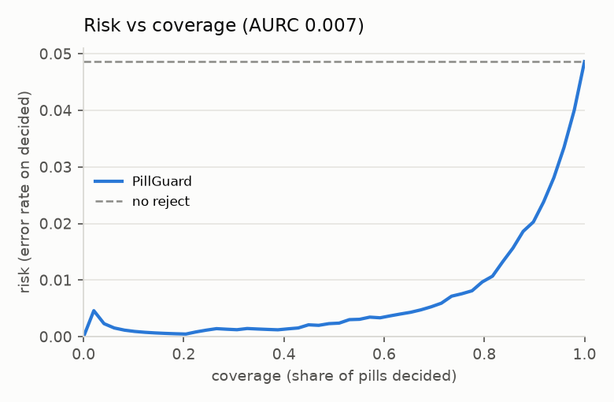
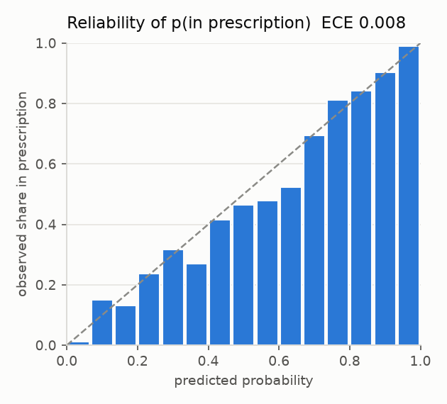

# PillGuard benchmark

Test split, pill level: 10701 pills (5896 in prescription, 4805 out) over 3089 prescription scenarios. Regenerate with `pillguard eval --mode detector`, `pillguard eval --mode oracle` and `python scripts/fill_readme.py`.

## End to end

*Detector boxes* is the whole system. *Ground-truth boxes* isolates recognition and the decision
layer from detection. *No reject* is the same model forced to answer for every pill.

| metric | detector boxes | ground-truth boxes | no reject |
|---|---|---|---|
| out-of-prescription recall (decided) | **99.4 %** | 99.3 % | 94.6 % |
| out recall, strict (abstain counts as a miss) | 96.9 % | 97.4 % | 94.6 % |
| false alarm rate (decided) | **9.3 %** | 9.9 % | 4.4 % |
| abstain rate | **10.8 %** | 10.8 % | 0 % |
| risk (error rate on decided pills) | 5.0 % | 5.4 % | 4.9 % |
| detection recall (IoU >= 0.5) | 99.6 % | 100.0 % | – |
| ECE of p(in prescription) | 0.0080 | 0.0069 | – |
| risk-coverage AURC | 0.0070 | – | – |

Image level over 3089 scenarios: alert recall 99.6 %, false alert rate 50.8 % (tp 2017, fp 540, fn 8, tn 524).

Spurious detections, boxes matching no labelled pill: 98 (69 judged out, 18 uncertain, 11 in).

## Seen vs unseen drugs (detector boxes)

| subset | pills | out recall | false alarm | abstain |
|---|---|---|---|---|
| seen drugs | 8851 | 99.8 % | 8.4 % | 12.2 % |
| unseen drugs (12 held out) | 1850 | 98.8 % | 100.0 % | 4.2 % |

Unseen drugs have no prototypes by construction, so a pill of one that *is* on the prescription
can never be matched and is always flagged. Their 100 % false alarm rate is by design, and it is
what the held-out classes exist to measure.

## By reason

| subset | pills | out recall | false alarm | abstain |
|---|---|---|---|---|
| foreign | 1475 | 98.5 % | 0.0 % | 5.1 % |
| listed | 5896 | 0.0 % | 9.3 % | 18.0 % |
| removed | 3056 | 99.8 % | 0.0 % | 0.8 % |
| unseen | 274 | 100.0 % | 0.0 % | 0.0 % |

`listed` pills are the ones that *are* on the prescription, so out recall is undefined for them
and reads 0 %; their meaningful column is the false alarm rate.

## By scenario kind

| subset | pills | out recall | false alarm | abstain |
|---|---|---|---|---|
| clean | 5034 | 98.6 % | 9.2 % | 13.2 % |
| remove-1 | 3559 | 99.7 % | 10.2 % | 9.6 % |
| remove-2 | 2108 | 99.9 % | 7.8 % | 7.2 % |

## Calibration

| parameter | value |
|---|---|
| softmax temperature | 0.0863 |
| unknown-class bias | -0.7851 |
| Platt a / b on p_in | 0.8493 / 2.8613 |
| theta_in / theta_out | 0.975 / 0.750 |
| validation NLL, before to after | 0.5072 -> 0.1314 |
| validation ECE, before to after | 0.0818 -> 0.0073 |

Before is the network's own training softmax: T = 1/scale with no unknown class. A temperature
alone leaves p_in underconfident across the middle of its range, because it can sharpen the
distribution but not shift the reliability curve, so the fit adds an affine map in logit space.
A positive Platt b is that correction.

## INT8 quantisation

| model | fp32 | INT8 | agreement with fp32 |
|---|---|---|---|
| detector | 10.6 MB | 3.3 MB | 160 / 160 boxes, mean IoU 0.966 |
| embedding | 5.2 MB | 1.7 MB | nearest-prototype 0.878 -> 0.874, cosine 0.989 |

Both are mixed precision. One uint8 scale per tensor destroys the detector's output, which
concatenates box pixels with sigmoid scores, and MobileNetV3's early layers, whose activations
span a far wider range than the rest of the network, so those nodes stay in fp32. The export
raises rather than shipping a model that drifts past these margins.

Detector mAP@0.5 0.992, mAP@0.5:0.95 0.759 on the test split.

Python ONNX latency per image, 1 thread, detect + embed: median 87 ms, p90 98 ms.

## Python versus browser parity

The same 40 images through the Python pipeline and through `web/pipeline.js` on Node/WASM: verdicts agree on 100 % of cases (107 pills), boxes within 0.100 px, detector scores within 2.8e-08.

The largest p_in gap is 0.065. That is not the runtimes: given an identical input tensor the two produce identical embeddings to float32 precision. It is crop resampling, amplified by the sharp softmax. Verdicts are unaffected because the pills concerned sit far from the thresholds.

## Figures

Confusion pairs with example crops are deliberately absent: they are VAIPE photographs.
`pillguard eval` writes them to `artifacts/eval/test_detector/confusion_examples.png`.
