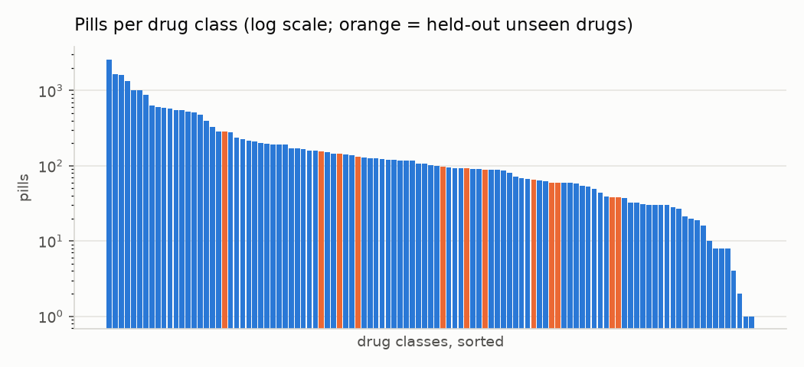
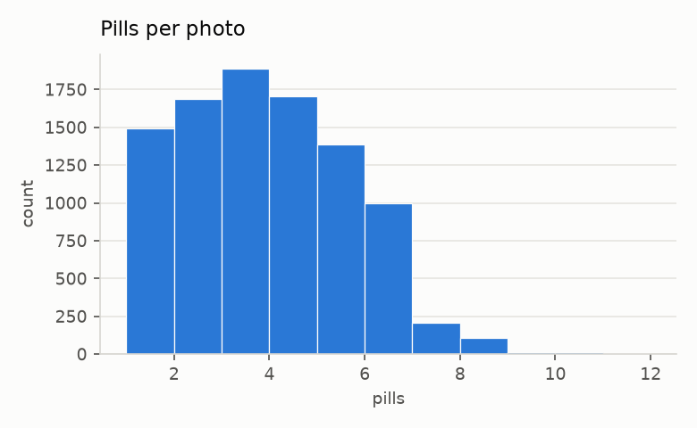
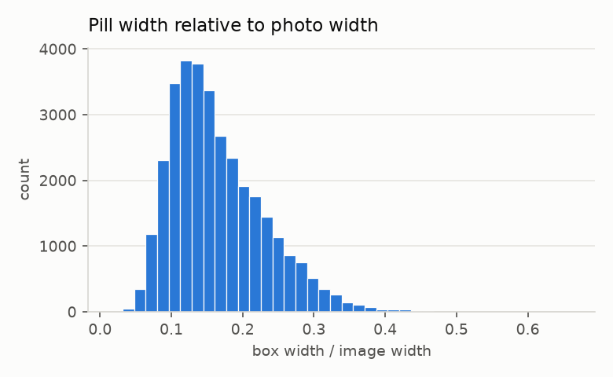
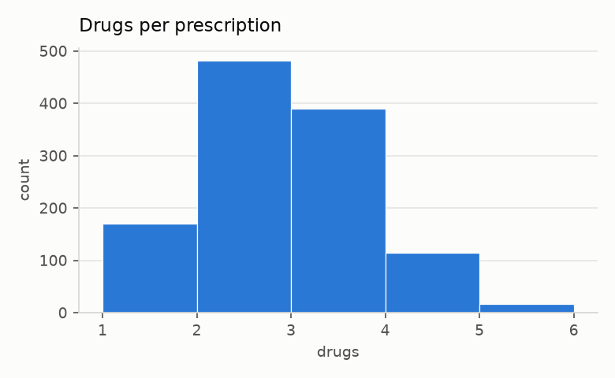

# VAIPE at a glance

Numbers computed by `python -m pillguard.data.eda` on the ingested mirror (labelled train split of the AI4VN-2022 release).

| quantity | value |
|---|---|
| photos | 9502 |
| pills (boxes) | 32828 |
| drug classes | 107 |
| prescriptions | 1173 |
| pills labelled 107 (not on the photo's prescription) | 8398 in 1884 photos |
| pills per photo | mean 3.45, max 11 |
| pills per class | min 1, median 102, max 2599 |
| classes with < 20 pills | 10: [13, 21, 25, 32, 49, 66, 77, 86, 88, 102] |
| pill width / photo width | p5 0.082, median 0.152, p95 0.289 |
| drugs per prescription | mean 2.42, max 5 |
| photos per prescription | mean 8.1, max 132 |
| saved photo size | [('960x1280', 6917), ('1280x960', 2039), ('720x960', 270)] |

## Fixed split (grouped by prescription)

| subset | photos | pills | prescriptions |
|---|---|---|---|
| train | 6622 | 22823 | 777 |
| val | 1430 | 4970 | 196 |
| test | 1449 | 5034 | 200 |

Unseen (held-out) drugs: [4, 6, 50, 63, 71, 74, 80, 81, 85, 95, 105, 106] = BECOSEMID 40mg, SADAPRON 300 300mg, FAMOGAST 40mg, BROMHEXIN ACTAVIS 8mg, VACO LORATADINE 10mg, MENISON 4MG 4mg, MILURIT 300mg, MELOXICAM 7,5mg, NORMAGUT 250mg, VENRUTINE 100mg +500mg, VITAMIN C STADA 1G 1g, C1000 FLOODE 1g

## Figures

